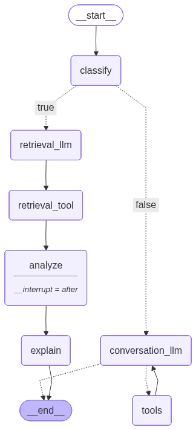

# persuasion-bias

A LangChain / LangGraph application for detecting and explaining persuasion techniques and cognitive biases in argumentative text. It exposes a conversational CLI backed by a retrieval-augmented generation (RAG) pipeline and a structured bias-analysis agent.

---

## Purpose

Given a user query, the system:

1. **Classifies** whether the input is an argument (vs. a casual question).
2. If it **is an argument** — retrieves similar persuasion examples from the [Anthropic/persuasion](https://huggingface.co/datasets/Anthropic/persuasion) dataset, runs a structured bias analysis (Cialdini principles, logical fallacies, emotional manipulation, credibility issues), and presents results either as raw JSON or a verbose natural-language explanation.
3. If it **is not an argument** — falls back to a general-purpose conversational assistant with optional tool use (time, arithmetic).

---

## Quickstart

```bash
# Install (requires Python ≥ 3.12, uv)
uv sync

# Run with default config (vLLM + Chroma + graph agent)
pbias

# Override at the CLI
pbias agent=react llm=openai vectorstore=memory
pbias llm.model=Qwen/Qwen3-30B-A3B-Instruct-2507 llm.base_url=http://localhost:8000/v1
```

---

## Configuration

Configuration is managed with [Hydra](https://hydra.cc/). The root config is `conf/config.yaml`:

```yaml
defaults:
  - agent: react      # which agent to use
  - llm: vllm
  - loader: persuasion
  - embedding: sentence_transformers
  - vectorstore: chroma

retriever:
  search_type: similarity
  search_kwargs:
    k: 4              # top-k documents retrieved
```

### Config groups

| Group | Options | Key fields |
|---|---|---|
| `agent` | `react`, `react-api`, `graph` | `_target_`, `prompts`, `memory` |
| `llm` | `vllm`, `openai`, … | `model`, `base_url`, `api_key` |
| `embedding` | `sentence_transformers`, `openai` | `model_name`, `device` |
| `vectorstore` | `chroma`, `memory` | `collection_name`, `persist_directory` |
| `loader` | `persuasion` | `repo_id` |

All prompts are resolved via the `${prompt:TEMPLATE_NAME}` Hydra resolver, which reads constants directly from `persuasion_bias.prompts.templates`.

The `${decide_device:}` resolver auto-selects `cuda` / `mps` / `cpu` at runtime.

---

## Schemas

### `BiasAnalysis`

The structured output of the analysis node:

```python
class BiasAnalysis(BaseModel):
    detected_principles: list[BiasDetection]   # Cialdini principles found
    overall_bias_score: float                   # 0–1
    logical_fallacies: list[str]
    emotional_manipulation_score: float         # 0–1
    credibility_issues: list[str]
    target_audience_analysis: str
```

### `BiasDetection`

```python
class BiasDetection(BaseModel):
    principle: CialdiniPrinciple   # reciprocity | commitment | social_proof | authority | liking | scarcity
    severity: Literal["low", "mid", "high"]
    confidence: float              # 0–1
    evidence: str                  # verbatim excerpt from the input
```

### `GraphState`

```python
class GraphState(MessagesState):
    query: str
    is_argument: bool
    retrieval: str
    analysis: BiasAnalysis
    user_choice: Literal["y", "n"]
    explanation: str
    conversation_messages: Annotated[list[BaseMessage], add_messages]
    analysis_messages: Annotated[list[BaseMessage], add_messages]
```

---

## Agents

### `BiasExplanationGraph` (recommended)

A two-branch **LangGraph** `StateGraph` with human-in-the-loop, compiled with `interrupt_after=["analyze"]`.

**Graph**



**Human-in-the-loop:** After `analyze` completes, execution pauses. The user is prompted:

```
Verbose (y) or JSON output (n)? [y/n]:
```

- `y` — the `explain` node generates a full natural-language explanation via LLM.
- `n` — the `explain` node short-circuits and returns the raw `BiasAnalysis` JSON.

**Config** (`conf/agent/graph.yaml`):

```yaml
_target_: persuasion_bias.agents.graph.BiasExplanationGraph
llm: ${llm}
prompts:
  is_argument: ${prompt:IS_ARGUMENT_TEMPLATE}
  conversation: ${prompt:CONVERSATION_PROMPT}
  retrieval: ${prompt:RETRIEVAL_PROMPT}
  analysis: ${prompt:ANALYSIS_PROMPT}
  explanatory: ${prompt:EXPLANATORY_PROMPT}
```

**Usage:**

```python
graph = BiasExplanationGraph(llm=model, prompts=prompts, tools=tools)
response = graph("Argument: Self-driving cars are dangerous")
```

---

### `ReActChain`

A manual ReAct (Reason + Act) loop — no LangGraph dependency. Runs up to `max_iterations` think/observe cycles using `bind_tools`. Maintains a scratchpad and exposes `chat_history`.

**Config** (`conf/agent/react.yaml`):

```yaml
_target_: persuasion_bias.agents.react.ReActChain
llm: ${llm}
prompts:
  system: ${prompt:${system_prompt}}
```

**Usage:**

```python
agent = ReActChain(llm=model, prompts=prompts, tools=tools, max_iterations=3)
response = agent("What time is it?")
```

---

### `ReActAPI`

A thin wrapper around `langchain.agents.create_agent` (LangGraph prebuilt). Supports persistent in-memory conversation history via `InMemorySaver` checkpointing and per-call `thread_id` switching.

**Config** (`conf/agent/react-api.yaml`):

```yaml
_target_: persuasion_bias.agents.agent.ReActAPI
llm: ${llm}
prompts:
  system: ${prompt:${system_prompt}}
memory: ${oc.select:memory, true}
```

**Usage:**

```python
agent = ReActAPI(llm=model, prompts=prompts, tools=tools)
response = agent("Tell me about social proof")

# switch conversation thread
response = agent("Continuing...", thread_id="other-thread-id")
```

---

## Knowledge Base

The retriever is backed by the [Anthropic/persuasion](https://huggingface.co/datasets/Anthropic/persuasion) HuggingFace dataset. Each record contains a claim, an argument, a persuasion technique label, and human persuasiveness ratings (initial and final). Documents are deduplicated by argument text and stored with rich metadata:

```
Document ID: 42
Claim: ...
Argument: ...
Source: Human | AI
Persuasion type: Appeal to Emotion | ...
```

Vectorstore backends:

- **Chroma** (`conf/vectorstore/chroma.yaml`) — persistent on disk, skips re-indexing if the collection is populated.
- **In-memory** (`conf/vectorstore/memory.yaml`) — ephemeral, rebuilt each run.

Default embedding: `sentence-transformers/all-MiniLM-L6-v2` (device auto-detected).